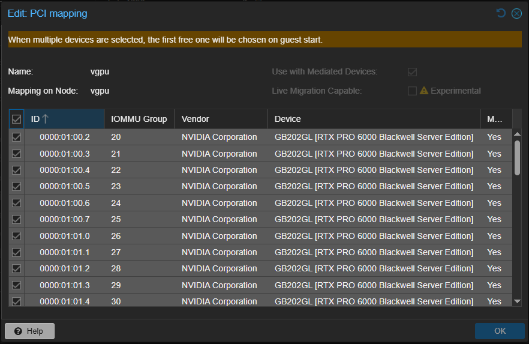

This is a little Bash script that configures a Proxmox 8 or 9 server to use Nvidia vGPU's. 

For further instructions see original author's blogpost at https://wvthoog.nl/proxmox-7-vgpu-v3/


Changes in version 1.4 (current release)
- Fixed patch compatibility issue with Debian 13 (Proxmox 9) where patch v2.8 causes NUL byte errors during driver patching.
- Added automatic detection and installation of patch v2.7.6 when needed for NVIDIA driver patching.
- Improved error logging for the patching process.
- **Note**: Driver version 19.1 (580.82.02) currently has no patch file available. Please wait for the 580.82.02.patch release. Current vGPU patching works on 19.0 and 18.x versions only.

Changes in version 1.3
- Added support for driver version 19.1 (580.82.02) - supports RTX PRO 6000 Blackwell Server Edition.
- Updated supported vGPU driver versions to 18.3, 18.4, 19.0, and 19.1.
- Reordered driver selection menu to show newest versions first (19.1, 19.0, 18.4, 18.3).
- Reverted licensing system to use FastAPI-DLS (from v1.1) instead of nvlts (v1.2) for better reliability.
- **RTX 5000 Series Database**: Added all RTX 5000 desktop GPUs (5090, 5090 D, 5080, 5070 Ti, 5070, 5060 Ti, 5060, 5050) to database with driver version 19 (vGPU unlock not supported on consumer GeForce cards).
- **Database Improvements**: Updated gpu_info.db with corrected native vGPU support for RTX A5000. Improved 17 GPU descriptions by replacing generic "Graphics Device" entries with proper names from PCI IDs database.
- All other v1.2 improvements maintained (Proxmox 8/9 support, pve-nvidia-vgpu-helper, wget downloads).

▽ RTX PRO 6000 Blackwell Server Edition vGPU MDEV Enabled at Resource Mappings page of Proxmox VE 9



Changes in version 1.2 (forker anomixer's release)
- Added support for Proxmox 9.
- Removed support for Proxmox 7.
- Removed kernel pinning as it's no longer necessary.
- Integrated `pve-nvidia-vgpu-helper` for a more robust setup.
- Updated the host driver installation method and its service.
- Updated supported vGPU driver versions to 18.3, 18.4, and 19.0. Check [PVE Wiki](https://pve.proxmox.com/wiki/NVIDIA_vGPU_on_Proxmox_VE#Software_Versions).
- Removed support for older driver versions (16.x, 17.0).
- Switched from `megadl` to `wget` for downloading drivers from new URLs.

Changes in version 1.1 (original author wvthoog's latest release)
- Added new driver versions
    16.2
    16.4
    17.0
- Added checks for multiple GPU's
- Added MD5 checksums on downloaded files
- Created database to check for PCI ID's to determine if a GPU is natively supported
- If multiple GPU's are detected, pass through the rest using UDEV rules
- Always write config.txt to script directory
- Use Docker for hosting FastAPI-DLS (licensing)
- Create Powershell (ps1) and Bash (sh) files to retrieve licenses from FastAPI-DLS

## Database Management

The `gpu_info.db` SQLite database contains GPU compatibility information for vGPU detection (use [SQLite Tools](https://sqlite.org/download.html) to view/edit):

```bash
# View all native vGPU cards
./sqlite3.exe gpu_info.db "SELECT * FROM gpu_info WHERE vgpu='Native';"

# Add a new GPU (replace XXXX with actual device ID)
./sqlite3.exe gpu_info.db "INSERT OR IGNORE INTO gpu_info VALUES ('10de', 'XXXX', 'GPU Name', 'Native', '19;18;17', 'Architecture');"

# Update existing GPU support
./sqlite3.exe gpu_info.db "UPDATE gpu_info SET vgpu='Native', driver='19;18;17' WHERE deviceid='XXXX';"

# Check for duplicates
./sqlite3.exe gpu_info.db "SELECT deviceid, COUNT(*) FROM gpu_info GROUP BY deviceid HAVING COUNT(*) > 1;"
```

**Database Schema:**
- `vendorid`: GPU vendor (always "10de" for NVIDIA)
- `deviceid`: PCI device ID (primary key)
- `description`: GPU model name
- `vgpu`: Support level ("Native", "Yes", "No")
- `driver`: Supported driver versions (semicolon-separated)
- `chip`: GPU architecture

## To-Do
1.  Replace FastAPI-DLS with nvlts (https://git.collinwebdesigns.de/vgpu/nvlts) in the future release. (current nvlts may not work).
2.  Continue adding new GPU data to gpu_info.db as new models are released (RTX 5000 series desktop GPUs completed).


